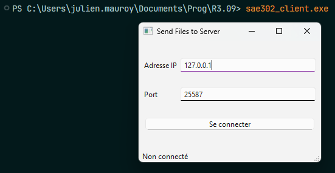

# Lancement du client

Après l'installation de l'application, vous devriez être en capacité de lancer le client à l'aide de la commande suivante :

```
sae302_client
```

Dans le cas où vous n'arrivez pas à lancer le client à l'aide de cette commande, vous pouvez aussi utiliser la commande suivante : (À partir du dossier racine du projet)

```
python ./src/sae302/client
```

Vous devriez obtenir la fenêtre suivante :

<figure><figcaption><p>Fenêtre de connexion au serveur</p></figcaption></figure>

Remplissez les informations, puis connectez vous.

## Envoi d'un fichier au serveur


Des exemples de fichier sont disponible dans `src/sae302/examples`.


Une fois connecté, vous devriez obtenir la fenêtre suivante :

<figure><figcaption></figcaption></figure>

De cette fenêtre, vous pouvez sélectionner quel fichier envoyer au serveur.

Une fois que vous avez sélectionner votre fichier, cliquez sur "Envoyer le fichier". Cela va envoyer le fichier au serveur, et l'exécuter si possible.

Dans le cas où le serveur ne peut pas exécuter le fichier, un message d'erreur sera affiché.

***

Le temps de l'exécution du programme, une fenêtre s'affichera avec un chronomètre, mesurant le temps d'exécution.

À la fin du programme, vous obtiendrez les logs du programme exécuté.

<div><figure><figcaption></figcaption></figure> <figure><figcaption></figcaption></figure></div>
